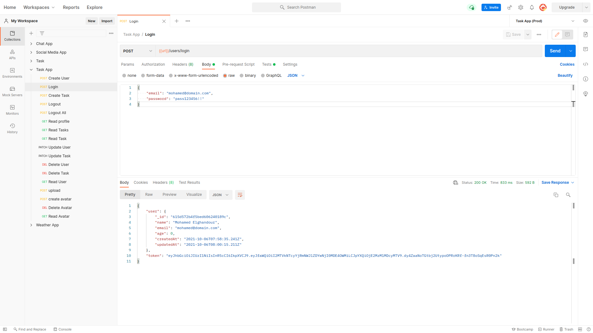
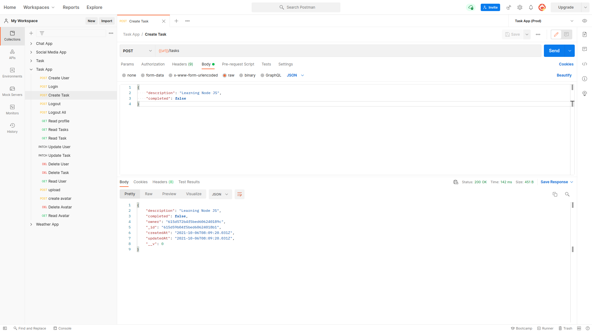

# Getting Started with Task Manager App

## Available Live Demo API

Click [Here](https://task-manager-ghandour.herokuapp.com/) to View the Production.

Server Link (API) : https://task-manager-ghandour.herokuapp.com/

### sign up

[](https://task-manager-ghandour.herokuapp.com/users)

### login

[](https://task-manager-ghandour.herokuapp.com/users/login)

### create task

[](https://chat-app-ghandour.herokuapp.com/tasks)

## Setup

Get the code:

```
git clone https://github.com/MohamedElGhandour/task-manager-learning-nodejs.git
```

Install dependencies:

```
cd task-manager-learning-nodejs
npm install
```

Run the server:

```
npm start
```

Run the server (dev mode):

```
npm run dev
```

Point a web browser at the demo:

```
http://localhost:4000
```

## Routes

Based on the `CRUD` Operations: `Create`, `read`, `update` and `delete` Users and Tasks.

### Users Routes

```
GET         /users/profile
GET         /users/:id/avatar
POST        /users/
POST        /users/login
POST        /users/avatar
POST        /users/logout
POST        /users/logoutAll
PATCH       /users/profile
DELETE      /users/profile
DELETE      /users/avatar
```

### Tasks Routes

```
GET         /tasks
GET         /tasks/:id
POST        /tasks
PATCH       /tasks/:id
DELETE      /tasks/:id
```

### Filter

```
GET /tasks?completed=true
```

### Paginate

Use `limit` and `skip` to paginate returned data.

```
GET /tasks?skip=7
GET /tasks?skip=7&limit=20
```

_10 items are returned by default_

### Sort

Add `sortBy` (ascending order by default)

```
GET /tasks?sortBy=createdAt:desc
GET /tasks?sortBy=createdAt:asc
```
